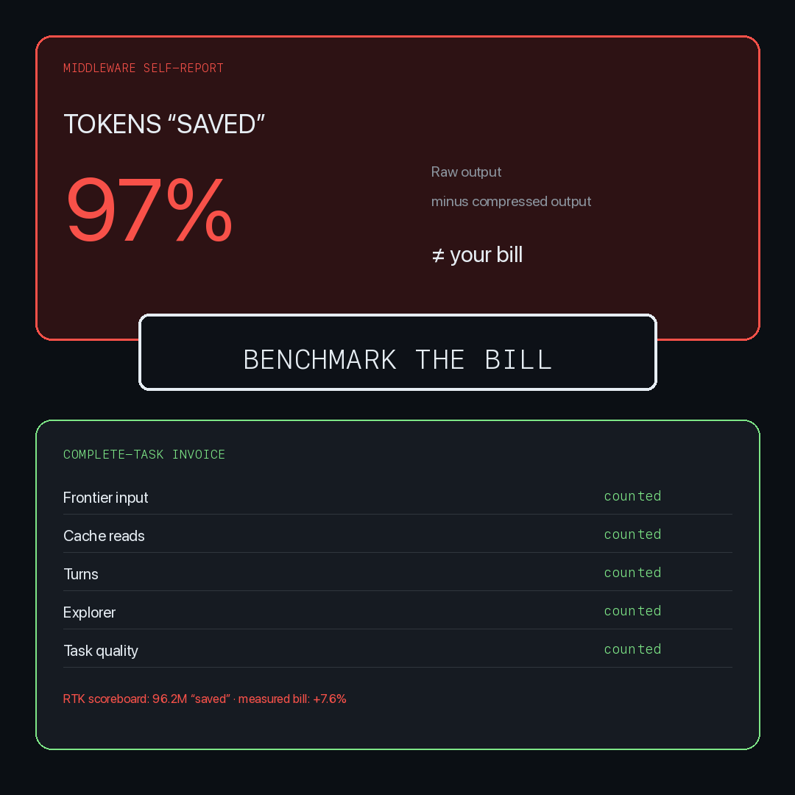
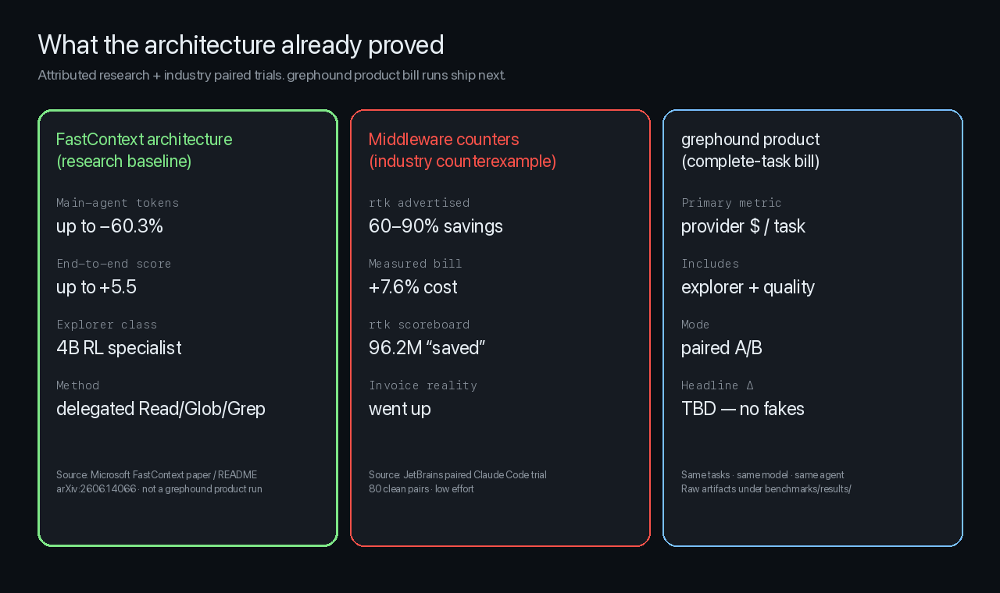

# Benchmarks

## Rule

**If the invoice didn't shrink, don't call it token savings.**




## What we can sell today (attributed)

Until grephound paired product runs land under `benchmarks/results/`, public numbers are **sourced**, not invented:

| Number | Meaning | Attribution |
|--------|---------|-------------|
| **−60.3%** main-agent tokens | Upper bound from delegated repo exploration | Microsoft FastContext ([arXiv:2606.14066](https://arxiv.org/abs/2606.14066), project README) |
| **+5.5** end-to-end score | Scout architecture can improve solve quality | FastContext SWE-bench-style evaluations |
| **+7.6%** task cost | Middleware “token killer” increased the bill | [JetBrains RTK trial](https://blog.jetbrains.com/ai/2026/07/rtk-claude-code-token-savings/) · 80 clean pairs · low effort |
| **96.2M tokens “saved”** | rtk self-report while invoice rose | Same JetBrains writeup |



**Rule for grephound headlines:** only medians from repeated paired complete-task runs, explorer included, quality counted.
We benchmark complete coding tasks:

| Metric | Why |
|--------|-----|
| Total provider cost | The bill |
| Main input / cache / output tokens | Frontier usage |
| Explorer cost / latency | Scout overhead (local or paid) |
| Turns | Control-loop waste |
| Wall-clock | UX |
| Task success | Quality gate |

We do **not** publish:

- “tokens avoided” by truncating tool output
- unpaired single runs as headlines
- quality-blind cost wins

## Methodology

See [docs/benchmarks/why-token-counters-lie.md](./docs/benchmarks/why-token-counters-lie.md).

Paired arms:

- **A** — coding agent alone
- **B** — same agent + grephound

Hold constant: model, reasoning setting, repo commit, task, agent version, timeout.

Modes (never mixed):

- **Natural** — tool available; agent decides
- **Forced** — exploration tasks instructed to use `repo_scout`

## Reproduce

```bash
cargo run -p grephound-bench -- --suite benchmarks
```

Raw results live under `benchmarks/results/`.

## Status

Harness scaffold ships in 0.1.0. Headline Δ numbers appear only after repeated paired runs.
