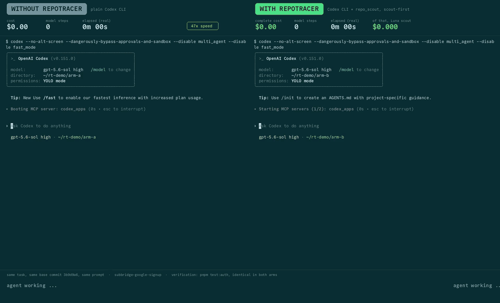
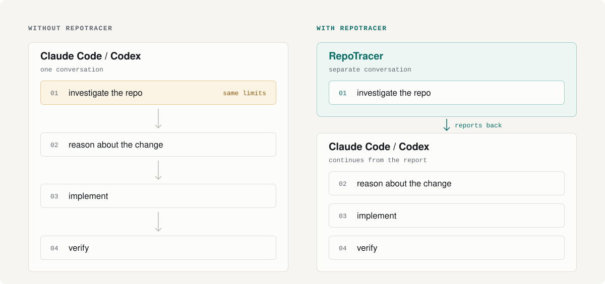

<p align="center">
  
</p>

<h1 align="center">A repo investigator for Claude Code and Codex.</h1>

<p align="center">
  RepoTracer has a separate agent investigate the repo and report back to Claude Code or Codex.
</p>

<p align="center">
  <b>Up to 2.7× as much work from the same limits · up to 25% faster</b><br>
  <b>When the outputs of the two runs differed in quality, RepoTracer produced the better result.</b><br>
  <sub>Same task, model, repo, and timeout. RepoTracer usage included. <a href="./BENCHMARKS.md">See every run</a>.</sub>
</p>

<p align="center">
  <b>Claude Code · Codex · MCP · MIT</b>
</p>

<p align="center">
  <a href="#demo">Demo</a> ·
  <a href="#benchmarks">Benchmarks</a> ·
  <a href="#install">Install</a> ·
  <a href="#architecture">Architecture</a> ·
  <a href="https://repotracer.tech">Website</a>
</p>

## Demo

<p align="center">
  <a href="assets/demo/paired-codex-8s.mp4"></a>
</p>

<p align="center"><sub>Same task · same model · same repo · same timeout · RepoTracer investigator usage included</sub></p>

```bash
npx repotracer@latest setup
```

---

## What changes



**Without RepoTracer**, every search and file read stays in the same conversation and counts against the same limits the coding agent later uses to implement the change.

**With RepoTracer**, RepoTracer runs the investigation in a separate conversation and reports back to the coding agent.

---

## We built RepoTracer to make the limits last longer. Then the code got better.

On the current complete-task benchmarks, the same limits covered **1.38× to 2.68× as much work**. When the outputs of the two runs differed in quality, RepoTracer produced the better result.

### Benchmarks

| Task | Direct | With RepoTracer | Same limits | Implementation time |
|---|---|---|---:|---:|
| Production bug fix | Bug fixed | Bug fixed | **2.68×** | **24.54% faster** |
| SWE-bench Astropy 13453 | Passing fix | Passing fix | **2.00×** | **9.60% faster** |
| Multi-language release | Broke 4 existing tests | Kept all existing tests passing | **1.38×** | 16.83% slower |

A complete run that costs 62.68% less lets the same fixed limit cover **2.68× as many runs**.

### How we measure

```text
without RepoTracer = coding-agent usage
with RepoTracer    = coding-agent usage + investigator usage
```

We only call it a saving if the whole run costs less and still passes the task's quality check.

Raw runs, grading, and checksums are public.

[Full benchmark writeup →](./BENCHMARKS.md)  
[Raw benchmark artifacts →](./benchmarks/README.md)  
[Why complete-task measurement matters →](./docs/benchmarks/why-token-counters-lie.md)

---

## What the investigator can do

- Trace behavior across files and related repos
- Follow definitions, references, callers, and execution paths
- Run checks or experiments to test a theory
- Continue a previous investigation instead of starting over
- Report what it could not resolve and what it already checked
- Run independent investigations in parallel

---

## When RepoTracer doesn't run

```text
"Rename this variable in src/config.ts"
  → Claude Code / Codex

"Trace why refresh tokens fail after rotation"
  → RepoTracer
```

The router made the right call on all **42 cases** in the current routing test.

**Install it once. Prompt normally.**

---

## Claude Code and Codex

Choose Claude Code, Codex, or both.

RepoTracer uses the native CLI you are already signed into. No second provider login or gateway account is required.

[Integration details →](./docs/CLAUDE_CODE_INTEGRATION.md)

### Bring your own investigator

Use any OpenAI-compatible endpoint, including Ollama or vLLM.

```bash
npx repotracer@latest setup \
  --base-url http://localhost:11434/v1 \
  --model deepseek-coder
```

---

<details>
<summary><strong>Why not just use a subagent?</strong></summary>

You can. The basic idea is the same: let another agent investigate the repo.

With RepoTracer, Claude Code or Codex can call that investigator through one MCP tool: `repo_scout`. Follow-ups can continue the same investigation instead of starting over.

</details>

<details>
<summary><strong>What if the investigator is not sure?</strong></summary>

It says so. The report includes what it found, what it checked, and what remains unresolved. Claude Code or Codex can continue from that work instead of repeating the investigation from scratch.

</details>

---

## Install

```bash
npx repotracer@latest setup
```

Choose Claude Code, Codex, or both, then accept the defaults or pick your investigator.

Run the same command later to reconfigure or uninstall.

Want the CLI in your shell too?

```bash
npm install -g repotracer
# or
cargo install --git https://github.com/repotracer/repotracer --locked repotracer
```

---

## Architecture

RepoTracer is a Rust MCP server. Native investigations run through the Claude Code or Codex CLI you already use. For OpenAI-compatible models, RepoTracer provides the repo tools and drives the investigation itself.

[Full architecture →](./docs/ARCHITECTURE.md)

---

<details>
<summary><strong>CLI reference</strong></summary>

```bash
repotracer "where is authentication handled?"
repotracer scout "trace refresh rotation"
repotracer symbols "Config" --mode references
repotracer serve
repotracer doctor
repotracer status
repotracer settings
repotracer update
repotracer uninstall --yes
```

`serve` runs the MCP server over stdio. `symbols` performs a local syntax lookup without a model call.

</details>

---

## Develop

```bash
git clone https://github.com/repotracer/repotracer
cd repotracer
cargo test --workspace
cargo run -p repotracer -- doctor
cargo run -p repotracer -- scout "where is config loaded?" --mock
```

CI runs without a GPU, local model runtime, or API key. Live native-CLI smoke tests are documented in [CONTRIBUTING.md](./CONTRIBUTING.md).

---

## Resources

- [Website](https://repotracer.tech)
- [Benchmarks](./BENCHMARKS.md)
- [Architecture](./docs/ARCHITECTURE.md)
- [Security](./SECURITY.md)
- [Claude Code and Codex integration](./docs/CLAUDE_CODE_INTEGRATION.md)
- [Contributing](./CONTRIBUTING.md)
- [Microsoft FastContext paper](https://arxiv.org/abs/2606.14066v3)

RepoTracer is an independent project inspired by FastContext. It is not affiliated with or endorsed by Microsoft. See [NOTICE](./NOTICE).

---

## License

MIT. See [LICENSE](./LICENSE) and [NOTICE](./NOTICE).
