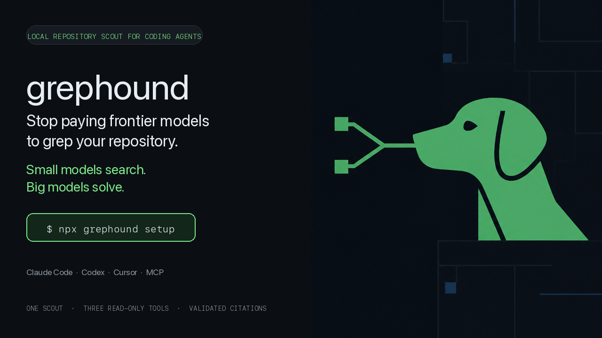
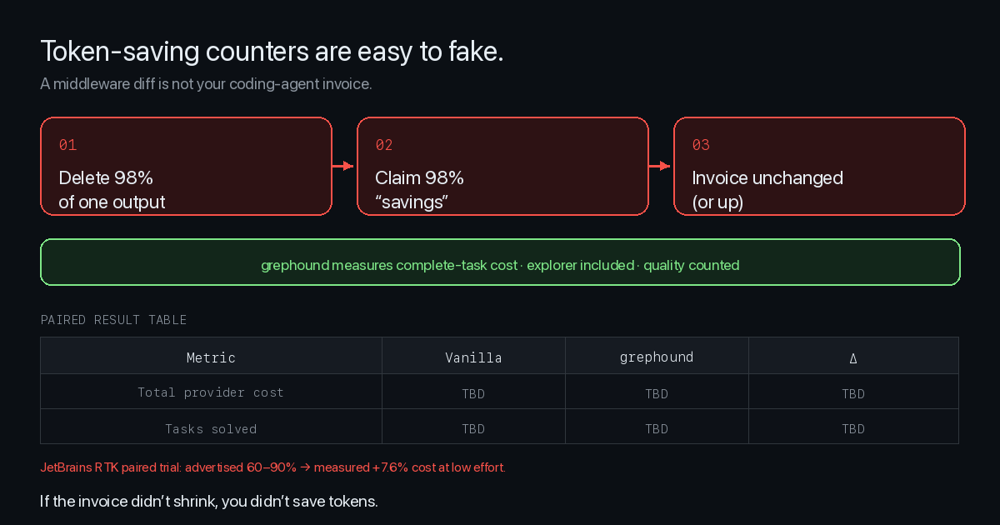
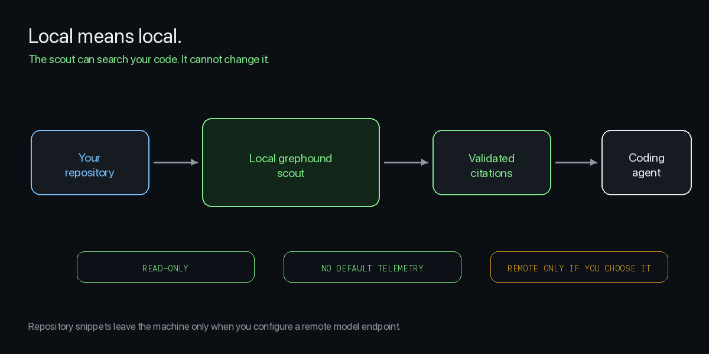

<p align="center">
  
</p>

<h1 align="center">grephound</h1>

<p align="center"><strong>Stop paying frontier models to search your repo.</strong></p>

**grephound** gives Claude Code, Codex, Cursor and other coding agents a small dedicated repository scout.

**Small models search. Big models solve.**

```bash
npx grephound setup
```

Works with: **Claude Code · Codex · Cursor · OpenCode · MCP**

### Why this exists (with numbers)

| Claim | Number | Source |
|------|--------|--------|
| Delegated exploration can cut **main-agent tokens** | **up to −60.3%** | [Microsoft FastContext](https://arxiv.org/abs/2606.14066) research baseline |
| End-to-end coding score with scout architecture | **up to +5.5** | FastContext on SWE-bench-style agents |
| “Token saver” middleware that grades its own homework | **rtk advertised 60–90%** | [rtk](https://github.com/rtk-ai/rtk) marketing |
| Same class of tool on a **paired complete-task bill** | **+7.6% more expensive** | [JetBrains RTK trial](https://blog.jetbrains.com/ai/2026/07/rtk-claude-code-token-savings/) · 80 pairs |

FastContext proved the **architecture**. JetBrains proved **middleware counters lie**.  
grephound is the production scout runtime that takes the first seriously and refuses the second.

<p align="center">
  
</p>

> grephound’s own paired product Δ ships only from raw `benchmarks/results/` artifacts. No invented savings.

<p align="center">
  
</p>

---

## The problem

<p align="center">
  
</p>

---

## Install

```bash
# from source (today)
cargo install --path crates/cli

# or
npx grephound setup
```

```bash
grephound setup
grephound doctor
grephound scout "where is authentication handled?"
```

---

## Token-saving counters are easy to fake

Delete 98% of a command's output and you can claim “98% fewer tokens.”

That does **not** mean your agent became 98% cheaper.

**We don't count characters we filtered. We measure the entire coding task.**

| We publish | We refuse |
|------------|-----------|
| Total provider $ / task | “tokens avoided” scoreboards |
| Explorer cost included | Unpaired one-off runs |
| Task success / quality | Quality-blind compression wins |
| Raw JSON artifacts | README fan fiction |

If the invoice didn't shrink, you didn't save tokens.

See [BENCHMARKS.md](./BENCHMARKS.md) · [why token counters lie](./docs/benchmarks/why-token-counters-lie.md)

<p align="center">
  
</p>

---

## How it works

1. Your coding agent calls one tool: `repo_scout`
2. A small specialist model explores with **read-only** `Read`, `Glob`, `Grep`
3. Independent tool calls run **concurrently**
4. Citations are **validated** (path + line bounds, no escapes)
5. The frontier model reads only those regions and solves

The scout can search your code. **It cannot change it.**

<p align="center">
  
</p>

---

## CLI

```bash
grephound "where is auth handled?"          # shorthand
grephound scout "trace refresh token rotation"
grephound serve                             # MCP stdio
grephound setup
grephound doctor
grephound status
grephound config --init
grephound uninstall --yes
```

Example output:

```text
Found 3 relevant locations in 1.2s

src/auth/refresh.ts:44-108
  Validates and rotates refresh tokens.

src/auth/session.ts:81-144
  Creates the replacement session.

tests/auth/refresh.test.ts:91-173
  Rotation and reuse-detection tests.

Scout: fastcontext
Turns: 3
Tool calls: 9
```

---

## MCP

Primary tool:

| Tool | Input | Output |
|------|--------|--------|
| `repo_scout` | `{ "query": "..." }` | summary + validated file:line citations |

Tool description is tuned so agents call it for exploration-heavy work and skip it for trivial edits.

```bash
grephound serve   # stdio MCP — never writes non-protocol text to stdout
```

---

## Local model

Default: OpenAI-compatible endpoint at Ollama.

```bash
ollama serve
# Use the official FastContext model when available in your registry, or any tool-calling model:
ollama pull <your-explorer-model>
```

Config (`~/.grephound/config.toml`):

```toml
[model]
backend = "ollama"
model = "fastcontext"
base_url = "http://127.0.0.1:11434/v1"

[explorer]
max_turns = 6
timeout_seconds = 60
```

Official specialist model: [microsoft/FastContext-1.0-4B-RL](https://huggingface.co/microsoft/FastContext-1.0-4B-RL)

---

## Examples

```bash
grephound scout "Trace how refresh-token reuse is detected and where sessions are revoked."
grephound scout "Find the full request path from POST /checkout to Stripe and identify rollback behavior."
grephound scout "Which code paths invalidate the build cache after package metadata changes?"
grephound scout "Find the implementation, tests, and configuration involved in retry backoff."
```

---

## Privacy

Local setup:

```text
your repository → local scout model → citations → your coding agent
```

No telemetry by default. No source code leaves the machine for the scout when using a local backend.

If you point the scout at a remote model endpoint, code snippets may reach that provider.

<p align="center">
  
</p>

---

## FAQ

**Why not just use grep?**  
Because the expensive model has to decide every grep/read step and consume the outputs. The scout owns that loop.

**Does the small model edit my code?**  
No.

**Is it always cheaper?**  
No. Trivial tasks may gain nothing. That's why agents should use the scout for exploration-heavy work — and why we benchmark complete tasks.

**Why not Serena / jCodeMunch / Context Mode / RTK?**  
Different layers. grephound delegates the entire exploration loop to a specialist model and returns validated citations. See the comparison notes in the docs.

---

## Develop

```bash
cargo test --workspace
cargo run -p grephound -- scout "where is config loaded?" --mock
cargo run -p grephound -- doctor
```

Architecture: [docs/ARCHITECTURE.md](./docs/ARCHITECTURE.md)

---

## Research credit

Built on insights from Microsoft **FastContext** ([paper](https://arxiv.org/abs/2606.14066), [model](https://huggingface.co/microsoft/FastContext-1.0-4B-RL), [source](https://github.com/Cirius1792/fastcontext)).

Production runtime, concurrent tools, packaging, MCP product surface, and complete-task benchmarks are grephound's.

Not affiliated with or endorsed by Microsoft. See [NOTICE](./NOTICE).

---

## License

MIT — [LICENSE](./LICENSE)
