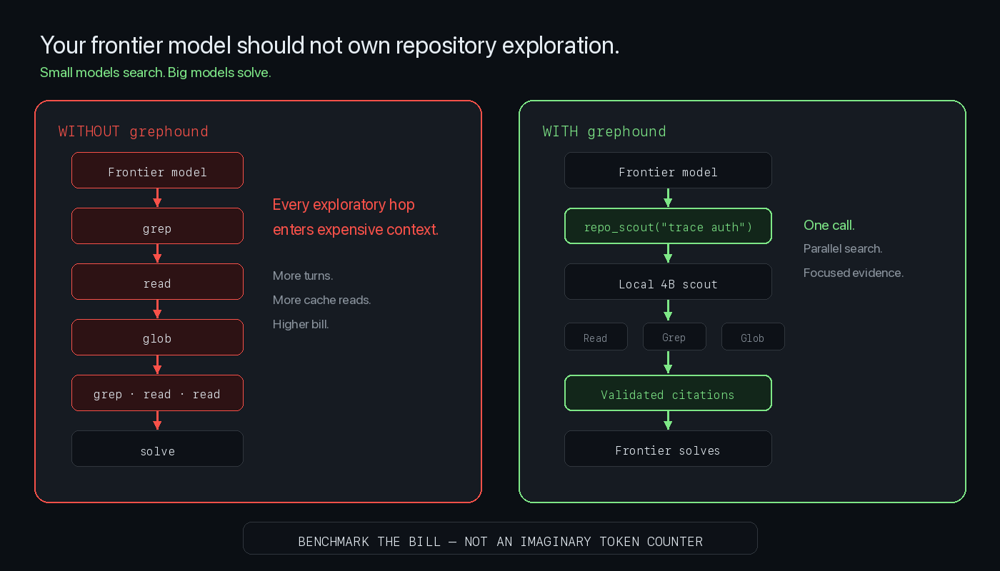
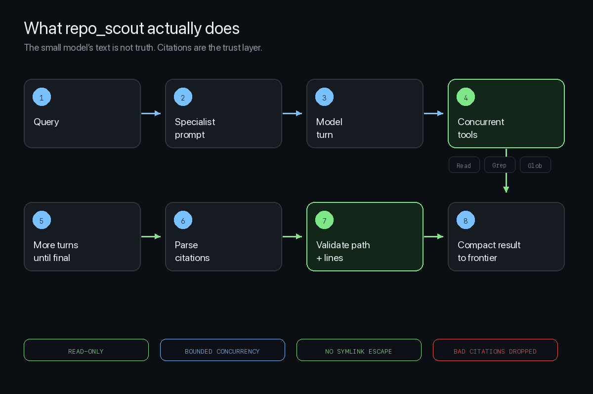
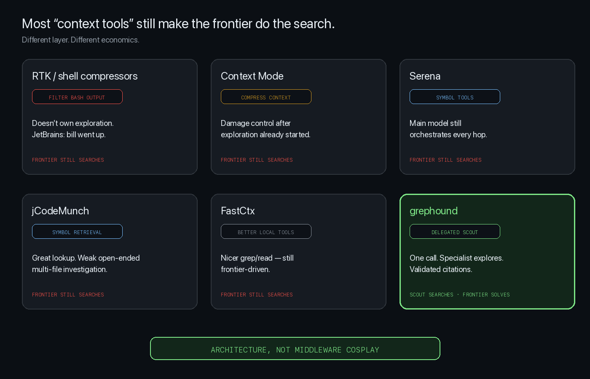

# Architecture

## Product thesis

```text
Generic MCP repository tool

Main LLM
 → grep
 → read
 → grep
 → read


grephound

Main LLM
 → repo_scout(question)
      ↓
   small specialist
      → Grep / Glob / Read  (concurrent)
      ↓
   validated citations
 → main LLM reads only those regions
 → solve
```



## Crates

| Crate | Role |
|-------|------|
| `grephound-repo-tools` | Read, Glob, Grep + concurrent executor |
| `grephound-model` | OpenAI-compatible backend + mock |
| `grephound-core` | Scout engine, citations, config |
| `grephound-mcp` | stdio MCP server (`repo_scout`) |
| `grephound` (cli) | setup / doctor / scout / serve |
| `grephound-bench` | complete-task benchmark harness |

## Engine loop

```text
query → system prompt → model
  → tool calls? → validate → execute concurrently → append results → loop
  → final text → parse <final_answer> → validate citations → ScoutResult
```

Hard controls: max turns, max tool calls, per-tool timeout, total timeout, output caps, cancellation via timeout.



## Security

- Read-only tools only
- Repo-root enforcement + symlink escape rejection
- Binary rejection on Read
- No shell interpolation
- No telemetry by default

## FastContext compatibility

Internal tools keep FastContext names and schemas so the specialist model stays effective.
Public product surface is one tool: `repo_scout`.

Upstream fixes included:

1. **Parallel tool execution** (was sequential)
2. **Grep `count` → `--count-matches`** (schema/impl mismatch)

## Category landscape


